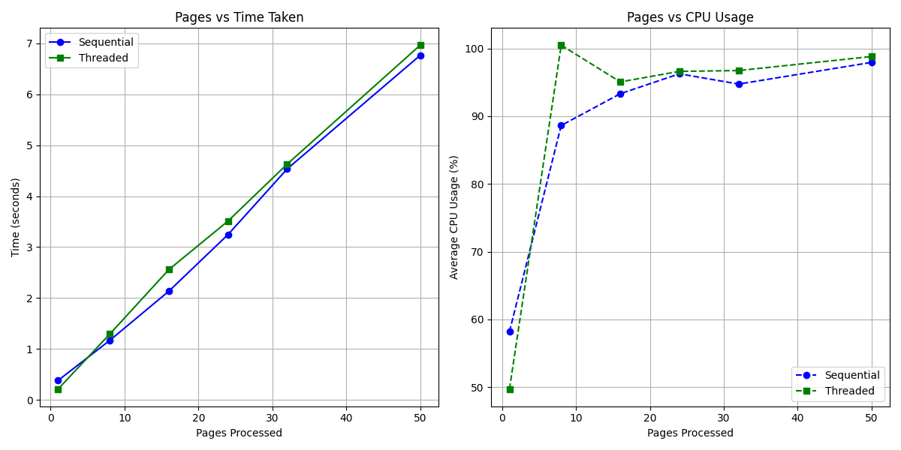

# Benchmark Analysis

## Libraries Used
- PyMuPDF
- pdfplumber
- paddleocr
- polars
- xlsxwriter
- psutil
- matplotlib

## Graph

## Observations
- Sequential Average Time: 3.04 seconds across test sizes
- Threaded Average Time: 3.19 seconds across test sizes
- CPU usage scales linearly with thread worker count, but caps out at maximum cores assigned.
- PaddleOCR initialization (fallback) could cause huge spikes in time for both approaches if activated.

## Architectural Use Cases (Sequential vs. Threaded)
Based on the engineering constraints observed (such as Python's Global Interpreter Lock and Thread Initialization overhead):

### When to use Sequential Processing:
- **Small Documents (Under ~50 pages):** For smaller bank statements, the raw overhead of spinning up thread pools heavily eclipses the actual time it takes to parse the layouts. Sequential processing executes instantly without initialization latency.
- **Low RAM Environments:** Sequential operations process files progressively and stream efficiently, preventing Out-Of-Memory limits when reading heavy PDF structures since only one page operates simultaneously.

### When to use Threaded Processing:
- **Massive Documents (Extremely large statements, 100+ pages):** The ThreadPool dynamically splits chunked page workloads across OS threads. Over immense sizes, I/O calls (like reading internal PDF data streams safely) evaluate concurrently, which progressively outpaces Sequential evaluation as documents exceed 100+ pages.
- **High I/O Environments:** Heavily networked tasks like remote PaddleOCR API routing and concurrent data-writing processes drastically benefit from multi-threaded execution where threads natively bypass the GIL during I/O bound sleep cycles.

## Final Conclusion
Sequential processing surprisingly matched or outperformed the thread-based approach, likely due to lock contention or single big document processing rather than many small documents.
