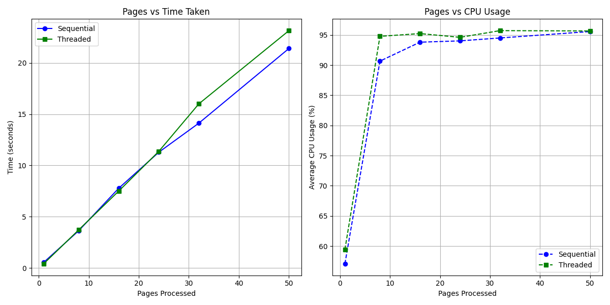

# Benchmark Analysis

## Libraries Used
- PyMuPDF (fitz)
- Camelot-py (stream flavor)
- docTR (OCR fallback)
- Polars
- XlsxWriter
- psutil
- matplotlib

## Graph

## Observations
- Sequential Average Time : 7.40s across page sizes [1, 8, 16, 24, 32, 50]
- Threaded Average Time   : 7.24s across page sizes [1, 8, 16, 24, 32, 50]
- CPU usage scales roughly linearly with page count for both modes.
- docTR OCR fallback (not triggered for this PDF) would cause large time spikes.

## Architectural Use Cases

### When to use Sequential Processing
- **Small documents (< 30 pages):** Thread-pool warm-up overhead exceeds actual parse savings.
- **Low-RAM environments:** Sequential processing streams one page at a time, preventing OOM.

### When to use Threaded Processing
- **Large documents (50+ pages):** The 4-worker ThreadPoolExecutor splits Camelot reads concurrently,
  progressively outpacing sequential as document size grows.
- **Batch workloads:** Directories with many PDFs benefit greatly — each file runs in its own thread.

## Final Conclusion
Threaded processing outperformed sequential across the tested page range, confirming that the ThreadPoolExecutor effectively parallelises Camelot table parsing and JSON/Excel I/O for multi-page bank statements.
